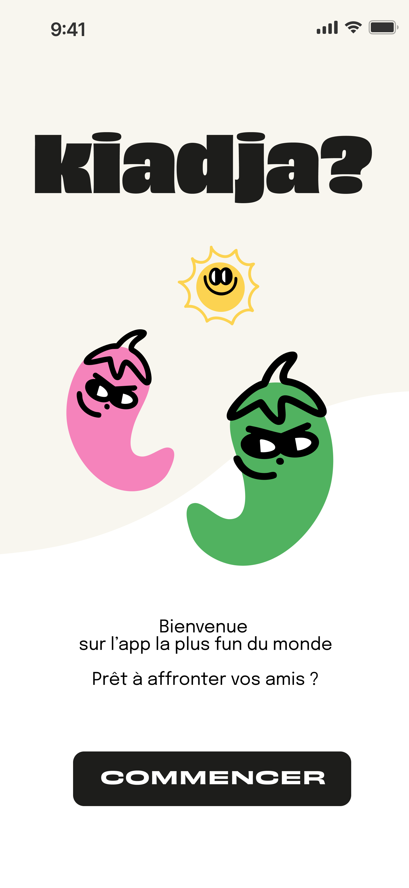
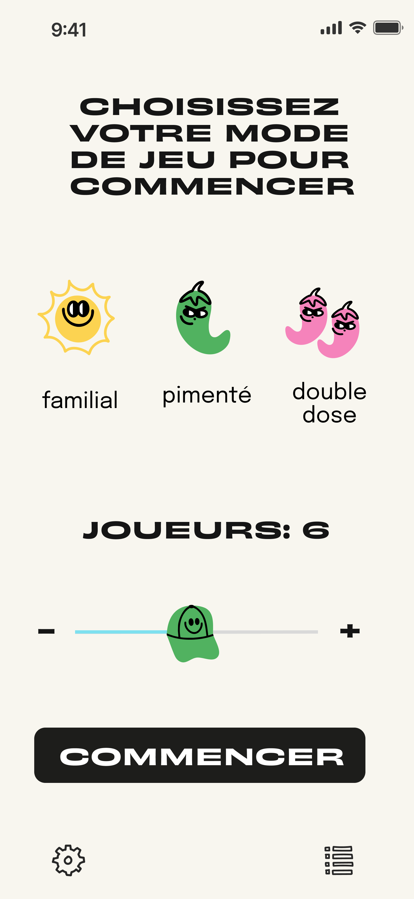
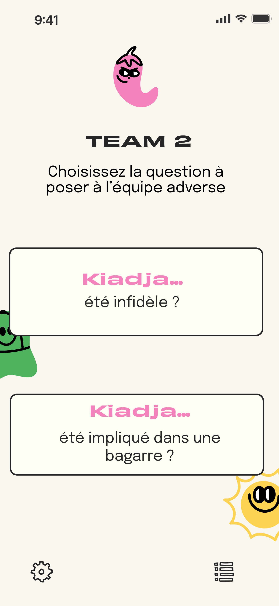
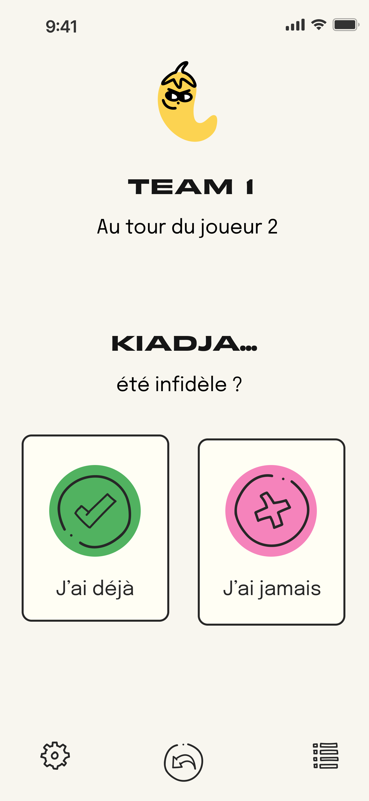

# Kiadja — Party Game App 🎉

🌶️ A mobile party game app built with **React Native (Expo)**.  
Available on **iOS & Android** → [Download here](https://onelink.to/5x4wsn)

---

## 🕹️ What is Kiadja?

Kiadja (“Qui a déjà ?”) is a team-based twist on the classic *Never have I ever*.  
You guess, debate, and discover each other’s funniest stories… until you laugh all night long.  

👉 The app is currently released in French. (EN version coming later)  
It’s the perfect app for your next evening with friends.

---

## 🚀 Features
- Team-based party game mode
- Multiple modes (family-friendly, spicy, double dose)
- Fun illustrations & art direction by [Agathe Braut](https://www.agathebraut.com)
- In-app subscriptions via **RevenueCat**
- Push notifications
- Analytics with **PostHog**

---

## 🛠 Tech Stack
- React Native (Expo)
- RevenueCat (In-App Purchases & subscriptions)
- Firebase Firestore
- PostHog (analytics)

---

## 📸 Screenshots
_(Screens are in French version of the app)_

  
  

  
  

---

## 🤝 How to support
- ⭐ Leave a 5-star review on the stores (it helps visibility a lot!)  
- 🎉 Play it at your next party and share it with friends  

---

## 👩‍💻 About
Built by **Agathe Peyrint** — Frontend & Mobile Engineer  
Ex-Heetch · React / Next.js · React Native  

- GitHub: [agathepey](https://github.com/agathepey)  
- LinkedIn: [agathe-peyrint](https://www.linkedin.com/in/agathe-peyrint-6857b391/)  
- Email: agathe.peyrint@gmail.com
